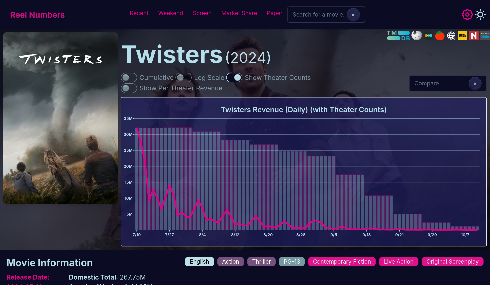
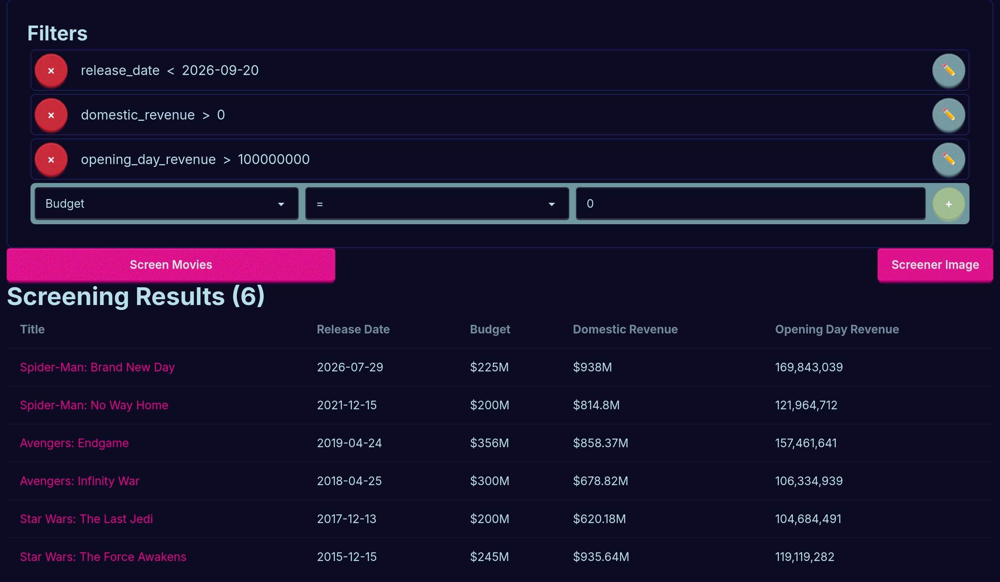

# Reel Numbers

Daily domestic box-office tracking, analysis, and forecasting.

[Live site](https://bo.aidang.me/recent) · [Research paper](https://repository.rice.edu/items/0705cb7e-f675-4b07-a557-dacba382b691)


Reel Numbers combines a Python data pipeline with a SvelteKit application. It collects box-office and movie metadata, builds forecasts from comparable releases, and provides tools for exploring daily grosses, theatrical runs, and market trends.

The forecasting method updates a movie's expected daily and total domestic revenue as new results arrive. It selects comparable releases with K-nearest neighbors, then applies historical daily, weekly, and seasonal multipliers across the remainder of the theatrical run.

## Features

- Daily and weekend domestic box-office tables
- Revenue histories, theater counts, and per-theater performance
- Continuously updated movie forecasts and comparison films
- Search, market-share analysis, and a configurable movie screener
- Data assembled from The Numbers, TMDB, IMDb, Metacritic, Wikipedia, and YouTube

## Screenshots

### Movie performance



Capture the poster, revenue chart, and comparison controls from the [Twisters movie page](https://bo.aidang.me/m/97ab9d16-90c2-4901-b33a-159448ba2579).

### Movie screener



Capture the filters and results from the [movie screener](https://bo.aidang.me/screen). A filter such as `Budget > 100000000` will make the screenshot more illustrative than the default state.

## Repository

- [`boxoffice/`](boxoffice/) — data collection, modeling, prediction, and evaluation
- [`boxofficeapp/`](boxofficeapp/) — SvelteKit and Tauri application
- [`paper/`](paper/) — methodology and results
- [`shared/`](shared/) — figures and bibliography

## Paper

The accompanying paper, **The Gerber Method: Using Multipliers for Daily Box Office Prediction**, describes the forecasting approach, model selection, and evaluation in detail.

The model was trained with data from more than 3,000 theatrical releases from 2015 through 2025. In the paper's evaluation, it achieved a median weighted mean absolute percentage difference of approximately 0.20 while producing predictions for the full daily theatrical run—not only the opening weekend or final gross.

[Read the published paper](https://repository.rice.edu/items/0705cb7e-f675-4b07-a557-dacba382b691) or browse the [LaTeX source](paper/paper.tex).

## Code highlights

- [`boxoffice/pipeline.py`](boxoffice/pipeline.py) coordinates data collection and database updates.
- [`boxoffice/predict.py`](boxoffice/predict.py) contains the forecasting and evaluation code.
- [`boxoffice/predict_daily.py`](boxoffice/predict_daily.py) generates updated daily predictions.
- [`boxofficeapp/src/routes`](boxofficeapp/src/routes/) contains the main application views.

## Setup

Python requires 3.12 or newer and uses [uv](https://docs.astral.sh/uv/).

```sh
cp .env.example .env
uv sync
```

The frontend uses Bun.

```sh
cd boxofficeapp
bun install
bun run dev
```

See `.env.example` for the required Supabase and API configuration.
